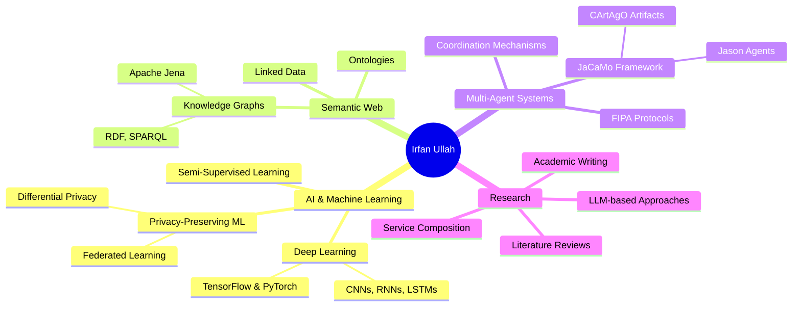

<div align="center">
  
# 👋 Hi, I'm Irfan Ullah

[](https://git.io/typing-svg)


[](https://linkedin.com/in/your-profile)
[](mailto:your.email@example.com)
[](https://researchgate.net/profile/your-profile)

</div>

---

## 🚀 About Me

```python
class IrfanUllah:
    def __init__(self):
        self.name = "Irfan Ullah"
        self.role = "AI & Semantic Web Researcher"
        self.education = {
            "current": "M2 Master's in Computer Science",
            "university": ["University Jean Monnet", "École des Mines de Saint-Étienne"],
            "specialization": "Cyber-Physical and Social Systems (AI & IoT)",
            "location": "Saint-Étienne, France 🇫🇷"
        }
        self.research_interests = [
            "Semantic Web & Knowledge Graphs",
            "Multi-Agent Systems (JaCaMo)",
            "Machine Learning & Deep Learning",
            "Privacy-Preserving ML",
            "LLM-based Service Composition"
        ]
        self.current_work = "Representation of Physical Quantities on Semantic Web"
        
    def achievements(self):
        return {
            "epilepsy_detection": "99.39% accuracy using 1D CNN-LSTM",
            "research_areas": ["Federated Learning", "Agentic AI", "Semantic Web"],
            "projects": ["Tolkien Knowledge Graph", "Multi-Agent Coordination Systems"]
        }
```

<div align="center">

### 🎓 Education Journey

🇵🇰 **Bachelor's in Computer Science** → 🇫🇷 **Master's in AI & IoT**

**Current Internship:** *École des Mines de Saint-Étienne* (Feb - Jun 2026)  
📍 LIMOS Laboratory | Supervisors: Pierre MARET & Antoine ZIMMERMANN

</div>

---

## 💼 What I'm Currently Working On

<table>
<tr>
<td width="50%">

### 🏰 Tolkien Knowledge Graph
Building a comprehensive RDF-based knowledge graph from TolkienGateway.net
- **Tech:** Apache Jena Fuseki, RDF, SPARQL
- **Challenge:** DBpedia entity linking & data quality
- **Goal:** Semantic representation of Middle-earth

</td>
<td width="50%">

### 🤖 Multi-Agent Systems
Implementing complex coordination scenarios using JaCaMo
- **Tech:** Jason Agents, CArtAgO Artifacts
- **Projects:** House construction, Skateboard assembly
- **Focus:** Tuple space coordination, FIPA protocols

</td>
</tr>
<tr>
<td width="50%">

### 🔬 Research: Service Composition
Literature review on automatic service composition
- **Era Coverage:** 2000-2025
- **Focus:** LLM-based autonomous composition
- **Technologies:** Semantic Web, Agentic AI

</td>
<td width="50%">

### 🛡️ Privacy-Preserving ML
Exploring privacy techniques in machine learning
- **Methods:** k-anonymity, l-diversity, Differential Privacy
- **Applications:** Synthetic data generation (VAE/GAN)
- **Use Case:** Network intrusion detection

</td>
</tr>
</table>

---

## 🛠️ Technical Skills

<div align="center">

### Languages & Frameworks


### AI & Machine Learning


### Semantic Web & Knowledge Graphs


### Cloud & DevOps


### Data & Databases


</div>

---

## 📊 GitHub Statistics

<div align="center">
  


</div>

<div align="center">
  


</div>

<div align="center">

[](https://github.com/ryo-ma/github-profile-trophy)

</div>

---

## 🔬 Research Highlights

<div align="center">

| Project | Description | Achievement |
|---------|-------------|-------------|
| 🧠 **Epileptic Seizure Recognition** | ML/DL classification on UCI dataset | **99.39% accuracy** with 1D CNN-LSTM |
| 🌐 **Semantic Web Research** | Physical quantities representation | Ongoing research at LIMOS Lab |
| 🤖 **Multi-Agent Systems** | JaCaMo implementation for coordination | Complex scenarios: construction & assembly |
| 🔐 **Privacy-Preserving ML** | Differential privacy & synthetic data | VAE/GAN for secure data generation |
| 📚 **Literature Review** | Service composition evolution | Comprehensive analysis: 2000-2025 |

</div>

---

## 🌟 Featured Projects

<div align="center">

[](https://github.com/Irfan-Ullah-cs/tolkien-knowledge-graph)
[](https://github.com/Irfan-Ullah-cs/jacamo-projects)

</div>

---

## 📈 Activity Graph

<div align="center">

[](https://github.com/ashutosh00710/github-readme-activity-graph)

</div>

---

## 🎯 Areas of Expertise

<div align="center">



</div>

---

## 📚 Latest Research Interests

- 🔗 **Semantic Web Technologies** - RDF, SPARQL, JSON-LD, SHACL
- 🤖 **Agentic AI** - Autonomous agents and multi-agent coordination
- 🔐 **Privacy & Security** - k-anonymity, l-diversity, differential privacy
- 🧠 **Large Language Models** - LLM-based service composition and automation
- 🌐 **Knowledge Representation** - Ontologies and knowledge graphs
- ☁️ **Cloud Computing** - AWS IoT, distributed systems

---

## 🏆 Academic Achievements

- 📖 Published research on epileptic seizure recognition
- 🎓 Master's degree specialization in AI & IoT
- 🔬 Research internship at École des Mines de Saint-Étienne
- 📊 Comprehensive literature review spanning 25 years of service composition research
- 💡 Multiple successful implementations of multi-agent systems

---

## 💬 Let's Connect!

<div align="center">

I'm always interested in collaborating on:
- 🌐 Semantic Web & Knowledge Graph projects
- 🤖 Multi-Agent Systems research
- 🧠 Machine Learning applications
- 🔬 Academic research collaborations

**Feel free to reach out if you want to discuss AI, Semantic Web, or just chat about tech!**

</div>

---

<div align="center">

### 📊 This Week I Spent My Time On

<!--START_SECTION:waka-->
<!--END_SECTION:waka-->

</div>

---

<div align="center">

### ✨ Fun Fact

💡 I built a knowledge graph of Tolkien's Middle-earth because why analyze boring datasets when you can work with hobbits, wizards, and epic quests! 🧙‍♂️⚔️

</div>

---

<div align="center">

**⭐️ From [Irfan-Ullah-cs](https://github.com/Irfan-Ullah-cs)**


</div>
